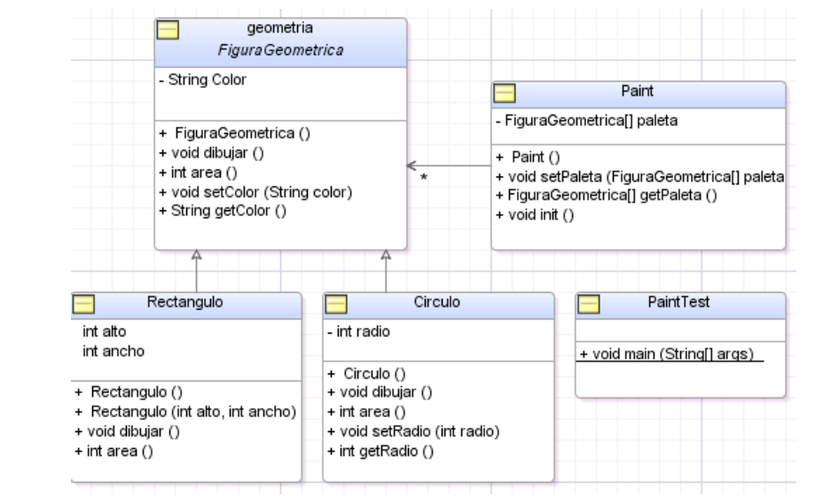

# Laboratorio de Software - Práctica 1

| Temas |
| -- |
| - Especificadores de acceso: private, public, protected, default |
| - Constructores de clases |
| - Clases abstractas |

---

1. Escriba una clase llamada `Vacuna` con 4 variables de instancia:
   - marca
   - país de origen
   - enfermedad que previene
   - cantidad de dosis
   Implemente los getters y setters para cada una de las variables de instancia anteriores.

   a) Sobre-escriba el método `toString()` de Object. Para ello, declare una variable local de tipo `StringBuffer` y utilícela para concatenar cada uno de los datos de la vacuna. Retorne un objeto `String` con los datos del mismo.

   b) Escriba el método `main()` en la clase `TestVacuna`, donde se debe crear un arreglo con 5 objetos `Vacuna` inicializados, para luego recorrer el arreglo e imprimir en pantalla los objetos guardados en él.

   c) Comente el método `toString()` escrito en la clase `Vacuna` y vuelva a ejecutar el programa. ¿Cuál es la diferencia entre b) y c)?

   ```java
    practica1.Vacuna@7c3df479
    practica1.Vacuna@7106e68e
   ```
   La diferencia es que en el punto anterior el resultado de la impresión es el resultado de lo que se definió en el método `toString()` sobreescrito en Vacuna pero en este caso se muestra una representación en cadena del objeto. Esta conformada por 
   - El paquete donde esta situado la clase de donde proviene el objeto
   - El nobmre de la clase
   - Un identificador del objeto 

   d) Cree otro objeto de tipo `Vacuna` y compárelo con el anterior. ¿Qué método de Object es utilizado para la comparación por contenido?
    
    El método que se utiliza para comparar dos objetos en cuanto a su contenido es `Object.equals()` el cual debe ser sobreescrito para que determine si dos objetos son iguales comparado por el contenido de sus variables. 


   e) Ejecute la aplicación fuera del entorno de desarrollo. ¿Para qué se utiliza la variable de entorno `CLASSPATH`?

   Es una variable de entorno (como PATH en los sistemas operativos) que le dice a la JVM (Java Virtual Machine) y al compilador javac dónde buscar las clases y librerías necesarias para ejecutar tu aplicación.


   f) Construya un archivo jar con las clases anteriores, ejecútelo desde la línea de comandos. ¿Dónde se especifica en el archivo jar la clase que contiene el método `main`?
   Se especifica en el archivo `MANIFEST.MF` que está en `META-INF/MANIFEST.MF` en el que se indica cómo se usa el archivo JAR. 
   ```md
    Manifest-Version: 1.0
    Main-Class: com.ejemplo.Main

   ```

2. Analice las siguientes clases y responda cada uno de los incisos que figuran a continuación.

   a) Considere la siguiente clase `Alpha`. ¿Es válido el acceso de la clase `Gamma`? Justifique.

   ```java
   package griego;
   class Alpha {
       protected int x;
       protected void otroMetodoA() {
           System.out.println("Un método protegido");
       }
   }

   package griego;
   class Gamma {
       void unMétodoG() {
           Alpha a = new Alpha();
           a.x = 10;
           a.otroMetodoA();
       }
   }
   ```

   Sí, es válido pues ambas clases pertenecen al mismo package (`griego`) por lo tanto la clase `Gamma` conoce la variable de la clase `Alpha`. 


   b) Considere la siguiente modificación de la clase `Alpha`. ¿Son válidos los accesos en la clase `Beta`? Justifique.

   ```java
   package griego;
   public class Alpha {
       public int x;
       public void unMetodoA() {
           System.out.println("Un Método Público");
       }
   }

   package romano;
   import griego.*;
   class Beta {
       void unMetodoB() {
           Alpha a = new Alpha();
           a.x = 10;
           a.unMetodoA();
       }
   }
   ```
    Sí, es válido pues se realizó la importación de la clase y tanto la variable como el método están definidos como `public`


   c) Modifique la clase `Alpha` como se indica debajo. ¿Es válido el método de la clase `Beta`? Justifique.

   ```java
   package griego;
   public class Alpha {
       int x;
       void unMetodoA() {
           System.out.println("Un mét. paquete");
       }
   }

   package romano;
   import griego.*;
   class Beta {
       void unMetodoB() {
           Alpha a = new Alpha();
           a.x = 10;
           a.unMetodoA();
       }
   }
   ```
   Ahora, ambas clases no comparten el mismo package. Es posible instanciar un objeto de clase Alpha, pero no acceder a su variable ni al método. Por lo tanto, el método de la clase Beta no es válido. 


   d) Considere el inciso c) ¿Es válido el acceso a la variable de instancia `x` y al método de instancia `unMetodoA()` desde una subclase de `Alpha` perteneciente al paquete `romano`? Justifique.

    No, pues el especificador si no está explícito es el por defecto _acceso package_.  Implica que tienen acceso a dicho miembro solamente las clases ubicadas en el mismo paquete que él. Para las clases declaradas en otro paquete, es un miembro privado.

   e) Analice el método de la clase `Delta`. ¿Es válido? Justifique analizando cómo influye el control de acceso `protected` en la herencia de clases.

   ```java
   package griego;
   public class Alpha {
       protected int x;
       protected void otroMetodoA() {
           System.out.println("Un método protegido");
       }
   }

   package romano;
   import griego.*;
   public class Delta extends Alpha {
       void unMetodoD(Alpha a, Delta d) {
           a.x = 10;
           d.x = 10;
           a.otroMetodoA();
           d.otroMetodoA();
       }
   }
   ```
   Dado que `Alpha` está definida como `public` sí se puede aplicar herencia. 
   Hacer `a.x = 10` y `a.otroMetodoA()` es inválido porque se lo está llamando desde el paquete romano por lo tanto no es accedible por fuera de éste. En el caso de `d.x = 10` y `d.otroMetodoA()` como Delta está declarado dentro del package `romano` sí se tiene acceso a los métodos y variables `protected`. 


3. Respecto de los constructores, analice los siguientes casos:

   3.1. Escriba 3 subclases de la clase `Vacuna` (definida en el punto 1) llamadas `VacunaPatogenoIntegro`, `VacunaSubunidadAntigenica` y `VacunaGenetica` con las siguientes variables de instancia:
   - `VacunaPatogenoIntegro`: define una variable de instancia destinada para el nombre del virus patógeno inactivado o atenuado.
   - `VacunaSubunidadAntigenica`: define 2 variables de instancia, una para guardar la cantidad de antígenos de la vacuna y la otra para mantener el tipo de proceso llevado a cabo.
   - `VacunaGenetica`: define dos variables de instancia, una para la temperatura mínima y otra para la temperatura máxima de almacenamiento.

   a) Implemente los getters y setters para cada una de las variables de instancia anteriores.

   b) Implemente los constructores para las clases anteriores, todos ellos deben recibir los parámetros necesarios para inicializar las variables de instancia propias de la clase donde están definidos.

   c) ¿Pudo compilar las clases? ¿Qué problemas surgieron y por qué? ¿Cómo los solucionó?

   Para que el constructor de VacunaPatogenoIntegro, VacunaSubUnidadAntigenica y VacunaGenetica funcione solo con las variables propias de la clase tuve que corregir el constructor de la clase Vacuna es decir hice una sobrecarga de método ya que definí un nuevo constructor en el que no sea necesario pasar parámetros. 

   3.2. El siguiente código define una subclase de `java.io.File`. Verifique si compila. Si no lo hace, implemente una solución.

   ```java
   package laboratorio;
   import java.io.File;
   public class MiArchivo extends File {
       public MiArchivo() {
           System.out.println("Mi Archivo instanciado");
       }
   }
   ```

   Nota: Recuerde que en la url https://docs.oracle.com/en/java/javase/24/docs/api/ tiene disponible la documentación de la API de Java.

   ```c
    MiArchivo.java:6: error: no suitable constructor found for File(no arguments)
    public MiArchivo(){
        ...
    }
   ```
   No compila porque no hay un constructor que esté definido sin argumentos. 

   ```java
    public MiArchivo(String text){
        //Una solución sería usar un constructor a elección de File y agregar parámetro necesario
        super(text);
        System.out.println("Mi archivo instanciado");
    }

    public MiArchivo(){
        // Poner algún valor por defecto para mantener sin parámetros este constructor
        super("Dirección"); //por defecto se le pasaría el texto que sigue 
        System.out.println("Mi archivo instanciado");
    }
   ```

3.3. Las clases definidas a continuación establecen una relación de herencia. ¿La implementación dada es correcta?

   **Constructores privados**
   ```java
   package laboratorio;
   public class SuperClase {
       private SuperClase() {
       }
   }

   package laboratorio;
   public class SubClase extends SuperClase {
       public SubClase() {
       }
   }
   ```
   No, porque el constructor sólo puede ser accedido por la propia clase, estaría permitido si el constructor de `SuperClase` tuviera el especificador `protected`. en `public SubClase()`, `super()` no es accesible porque el constructor de SuperClase es privado -> No compilaría porque el constructor no es visible. 


   **Constructores protegidos**
   ```java
   package laboratorio;
   public class SuperClase {
       protected SuperClase() {
       }
   }

   package laboratorio1;
   public class SubClase extends SuperClase {
       public SubClase() {
       }
   }

   package laboratorio1;
   public class OtraClase {
       public OtraClase() {
       }
       public void getX() {
           new SuperClase();
       }
   }
   ```
   En el caso de `SubClase` si funciona el constructor pues el constructor de la clase de la que hereda está visible aunque no se encuentre en el mismo package. Pero en el caso de `OtraClase` el método `getX()` el constructor de SuperClase está definida para que el constructor sólo sea visible para los que comparten el package lo cual no es el caso: no puede crear instancias de SuperClase directamente porque está en otro paquete y no es subclase.

4. Implemente una clase llamada `Logger` que siga el patrón Singleton. Esta clase debe garantizar que solo haya una instancia de Logger a lo largo de la ejecución de la aplicación. Proporcione un método estático `getInstance()` para acceder a esta instancia. Además, debe incluir métodos para registrar mensajes de diferentes tipos, como `logInfo(String mensaje)`, `logWarning(String mensaje)` y `logError(String mensaje)`, que simulen el registro de mensajes mostrándolos en la consola. Piense en los modificadores de acceso del constructor para buscar una solución.


5. Escriba las siguientes clases Java que figuran en el siguiente diagrama UML respetando cada una de las especificaciones para las clases y las relaciones entre ellas:

    

   Tenga en cuenta lo siguiente:
   - La clase `FiguraGeometrica` es una clase abstracta con 2 métodos abstractos: `dibujar()` y `area()`, y el resto de los métodos concretos.
   - Las subclases `Rectangulo` y `Circulo` son clases concretas. Ambas deben implementar el método `dibujar()` simplemente imprimiendo un mensaje en la consola. Por ejemplo: “se dibuja un círculo de radio 2 y de color azul” (donde el radio y el color son variables de instancia). El método `area()` debe implementarse en cada subclase de `FiguraGeometrica`.
   - En la clase `Paint`, el método `init()` debe crear las instancias de `Rectangulo` y `Circulo` y guardarlas en el arreglo `paleta`. Los valores para crear estas instancias son los siguientes:
     - Defina 2 objetos `Circulo` (radio 2 y color azul, radio 3 y color amarillo)
     - Defina 2 objetos `Rectangulo` (alto 2, ancho 3, color verde y alto 4 y ancho 10 y color rojo).
   - La clase `PaintTest` debe crear una instancia de `Paint`, inicializarla y recorrerla. En cada iteración invoque el método `area()` sobre el elemento actual y `getRadio()`, sólo si se trata de un objeto de tipo `Circulo`.
   - Construya un archivo jar ejecutable con las clases anteriores. El mismo debe poderse ejecutar como un programa haciendo doble click.

--- 
# Notas 

## Modificadores 
- `public`:  si una variable se declara como pública, se puede acceder a esa clase desde cualquier lugar. 
- `protected`: Se puede acceder a él si se comparte el mismo package o es **herencia**. Se puede aplicar a métodos y variables. 
- `private`: Sólo puede ser accedida dentro la clase.
- `package`: accesible solo para las clases ubicadas en el mismo package que él. Para las clasese declaradas en otro paquete, es un miembro privado. 

> En el caso en que no se especifique si la clase/método/constructor es publica o privada se usa por defecto el _package-private_ es decir, es accesible para los miembros del mismo package. NO PUEDE SER ACCEDIDO DESDE OTRO PAQUETE, NI SIQUIERA MEDIANTE HERENCIA.

> Sobre singleton: https://www.digitalocean.com/community/tutorials/java-singleton-design-pattern-best-practices-examples

> Sobre la generación del JAR: https://platzi.com/blog/como-crear-un-archivo-jar-en-intellij/