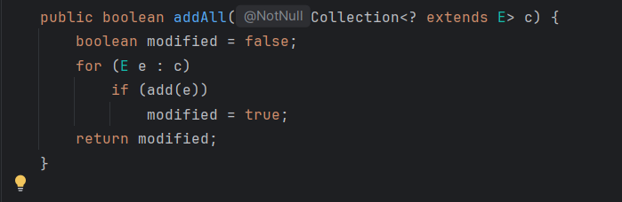

# Laboratorio de Software - Práctica 2

| Temas |
| -- |
| - Interfaces |
| - Polimorfismo |

1. Declaración e implementación de Interfaces.

   a) ¿Son correctas las siguientes declaraciones?

   ```java
   interface ColPrimarios {
       int ROJO = 1, VERDE = 2, AZUL = 4;
   }
   interface ColArcoIris extends ColPrimarios {
       int AMARILLO = 3, NARANJA = 5, INDIGO = 6, VIOLETA = 7;
   }
   interface ColImpresion extends ColPrimarios {
       int AMARILLO = 8, CYAN = 16, MAGENTA = 32;
   }
   interface TodosLosColores extends ColImpresion, ColArcoIris {
       int FUCSIA = 17, BORDO = ROJO + 90;
   }
   class MisColores implements ColImpresion, ColArcoIris {
       public MisColores() {
           int unColor = AMARILLO;
       }
   }
   ```

    No, no es correcta la forma: `Reference to 'AMARILLO' is ambiguous, both 'ColArcoIris.AMARILLO' and 'ColImpresion.AMARILLO' match`. Para que funcione es necesario corregir `MisColores`: `int unColor = colImpresion.AMARILLO` por ejemplo.  


   b) Analice el código de la interface y las clases que la implementan. Determine si son legales o no. En caso de ser necesario, realice las correcciones que correspondan. ¿Cómo podría modificar el método `afinar()` para evitar realizar cambios en las clases que implementan `InstrumentoMusical`?

   ```java
   public interface InstrumentoMusical {
       void hacerSonar(); 
       String queEs();
       void afinar() {}
   }


   abstract class InstrumentoDeViento implements InstrumentoMusical {

       void hacerSonar() {
           System.out.println("Sonar Vientos");
       }

       public String queEs() {
           return "Instrumento de Viento";
       }
   }


   class InstrumentoDeCuerda implements InstrumentoMusical {

        void hacerSonar() {
           System.out.println("Sonar Cuerdas");
        }

       public String queEs() {
           return "Instrumento de Cuerda";
       }
   }
   ```

    En el primer caso, en la interface al no colocar `public` en `void hacerSonar()` hace que el modificador por defecto sea el package-private pero todos los métodos de una interface deben ser públicos. 
    Sobre el método `afinar()` a partir de Java8 se permite implementar en una interface y para eso es necesario colocar el modificador `default` para que en el final quede `default afinar(){}` entones, todas las clases que implementen InstrumentoMusical heredan directamente ese comportamiento y no es necesario tocar las clases a menos que se busque sobreescribirlo. 
    

2. Redefina la clase `PaintTest` del ejercicio 6 de la práctica 1 de manera de imprimir las figuras geométricas ordenadas de acuerdo al valor de su área. Defina la comparación entre figuras geométricas usando la siguiente regla: una figura A es menor que una figura B si el área de A es menor que el área de B. Use para ordenar el arreglo de figuras los métodos de ordenación disponibles en la clase `java.util.Arrays`.

Lo hice con la interface List pero es casi lo mismo para ArrayList. 
Se agrega el _adjetivo_ Comparable y se implementa el método en la clase. El método es `CompareTo`.

```java
public int compareTo(FiguraGeometrica otraFigura){
        return Integer.compare(this.area(), otraFigura.area());
    }
```


3. Se desea implementar un tipo especial de `HashSet` con la característica de poder consultar la cantidad total de elementos que se agregaron al mismo. Analice y pruebe el siguiente código de manera de corroborar si realiza lo pedido.

```java

   public class HashSetAgregados<E> extends HashSet<E> {
       private int cantidadAgregados = 0;
       public HashSetAgregados() {
       }
       public HashSetAgregados(int initCap, float loadFactor) {
           super(initCap, loadFactor);
       }
       @Override public boolean add(E e) {
           cantidadAgregados++;
           return super.add(e);
       }
       @Override public boolean addAll(Collection<? extends E> c) {
           cantidadAgregados += c.size();
           return super.addAll(c);
       }
       public int getCantidadAgregados() {
           return cantidadAgregados;
       }
   }
```

No, no cumple lo que se pide ya que si se llena con un elemento suelto y una colección de 3 elementos se cuenta en total con 7 elementos lo que es erróneo porque son 4 elementos en total. 

a) Agregue a una instancia de `HashSetAgregados` los elementos de otra colección (mediante el método `addAll`). Invoque luego al método `getCantidadAgregados`. ¿La clase tiene el funcionamiento esperado? ¿Por qué? ¿Tiene relación con la herencia?

No funciona como se espera. En el método `addAll` al agregar la colección se llama al método `add` por lo tanto cadad elemento lo cuenta dos veces. 
 _Esto es muestra en `AbstractCollection.java` que implementa el método por `HashSet`

b) Diseñe e implemente una alternativa para `HashSetAgregados`. ¿Qué interface usaría? ¿Qué ventajas proporcionaría esta nueva implementación respecto de la original?

Ya que se desconocía el funcionamiento una opción sería que en vez de heredar de HashSet, HashSetAgregados conozca a HashSet de modo que no tenga que depender de la implementación. 

```java
public class HashSetAgregadosB<E> {
    private int cantidadAgregados = 0;
    private HashSet<E> hashSet;

    public HashSetAgregadosB(){
        this.hashSet = new HashSet<E>();
    }

```

En el siguiente punto lo reviso de nuevo. 

c) Se desea implementar otro tipo especial de `Set` con la característica de poder consultar la cantidad total de elementos que se removieron del mismo. Diseñe e implemente una solución que permita fácilmente definir nuevos tipos de `Set` con distintas características.
Según lo que se puede hacer es implementar Decorator de modo que se use la interface Set y con composición trasladar el comportamiento al objeto que lo ejecuta quedándonos sólo con comportamiento específico. 

```java
public class RemoveSet<E> implements Set<E> {
    private int cantidadRemovidos = 0;
    private Set<E> set;

    public RemoveSet(){
        this.set = new HashSet<>();
    }

    @Override
    public int size() {
        return set.size();
    }
    
    // y así con el resto de métodos y agregar el comportamiento deseado. 
```


4. Redefina las clases del ejercicio 6 de la práctica 1 de manera que las figuras se puedan serializar.

a) ¿Cómo se serializa un objeto? ¿Con qué fin?

A la clase que se busca serializar se le agrega el _adjetivo_ `Serializable`. Una vez hecho eso por convención se define una UID para controlar la compatibilidad de versiones al deserializar la clase. En caso de que se busque que un atributo no sea serializable es necesario agregarle `transient` para que se ignore durante el proceso. Los objetivos de serializar son:
- **Persistencia**: Guardar el estado de un objeto en disco para recuperarlo después.
- **Comunicación**: Enviar objetos a través de sockets, RMI o mensajes.
- **Clonación profunda**: Serializar y luego deserializar puede usarse como copia profunda.

b) ¿Qué relación tiene con el `serialVersionUID`? Analice su impacto al modificar la implementación de las clases.
`serialVersionUID` es un campo estativo que actúa como identificador de versión de la clase serializable. Si no se define, Java lo calcula automáticamente. 
Cuando se deserializa un objeto, Java compara el campo guardado en el archivo con el de la clase actual. Si coincide se deserializa correctamente, caso contrario lanza un excepción. 

**Impacto al modificar la clase**:
- Si se agregan/eliminan campos y no se definió un UID, el compilador recalcula uno diferente y la deserialización falla para objetos guardados con la versión vieja.
- Si se define el UID fijo, se puede cambiar la clase de forma compatible y seguir deserializando objetos antiguos (los campos nuevos tendrán valores por defecto).