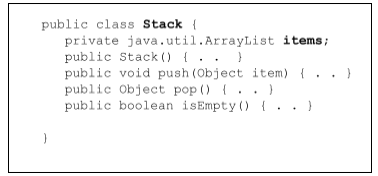

# Laboratorio de Software - Práctica 3

| Temas |
| -- |
| - Clases anidades y clases internas |
| - Clases anónimas |
| - Módulos |
| - Tipos Enumerativos |

1. Complete el código de la clase `Stack` en el paquete `practica3` de manera que implemente una pila de String:

a) Implemente un método `main()` para probar la pila. Agregue Strings a la pila y recórrala para imprimir sus valores. ¿Cuántas veces puede recorrerla?
Se puede recorrer una única vez porque los elementos se puede tener acceso con el método `pop`, por lo tanto la pila queda vacía. 
```java
        while(!stack.isEmpty()){
            //Lógica de recorrido
            System.out.println(stack.pop());
        }
```
b) Agregue una clase anidada llamada `StackIterator` que provea un objeto de tipo `Iterator` para recorrer la pila.

c) Agregue en la clase `Stack` un método para que retorne una instancia de `StackIterator`. ¿Cuántas veces puede recorrer la pila ahora?
d) ¿Es posible crear objetos `StackIterator` desde una clase diferente a la clase `Stack` con el operador `new`?, ¿cómo lo hace?
Sí, si se define a la clase anidada como pública se puede instanciar desde afuera: 
```java
Iterator<String> itr3 = stack.new StackIterator();
```

e) ¿Cómo haría para evitar crear instancias de una clase anidada desde una clase que no sea la que la definió?
Si se modifica el alcance a private no se puede instanciar desde afuera, si o sí desde la clase Stack. 


2. Analice el código que figura debajo: 
```java
class InnerStatic{

    static double PI = 3.1416;

    static class Circulo{
        static double radio = 2;

        static double getArea(){
            double a = PI * Math.pow(radio, 2);
            System.out.println("El area es: "+a);
            return a;
        }

        static double getLongitudCircenferencia(){
            double l = 2*PI*radio;
            System.out.println("La longitud es: "+l);
            return l; 
        }
    }
    //...
}
```
a) Modifique el código de la clase interna estática para que el valor inicial del radio sea ingresado por el usuario en el momento de la ejecución.
Agregué un `setRadio` al que se le setea de esa forma el valor a la variable estática.  
b) Defina una clase llamada `InnerTest` en el paquete practica3 con un método `main()` que imprime en la pantalla el área y la longitud de la circunferencia. Ejecútela varias veces ingresando distintos radios.
c) Remplazar `PI* Math.pow(radio,2)` por `PI* pow(radio,2)`, siendo `pow()` el método de la
clase `java.lang.Math`.

`import static` te deja usar métodos/constantes estáticos sin anteponer el nombre de la clase. Aporta menos código repetido y más legibilidad.


3. Implemente una clase llamada StringConverterSet como subclase de AbstractSet, la cual permita realizar todas las operaciones contempladas para los Set, con la salvedad que el método iterator() retorne un Iterator que al recorrelo devuelva cada uno de los elementos como Strings.
Para su solución, defina un Adapter llamado IteratorStringAdapter como una clase anidada de StringConverterSet para cumplir lo solicitado.

Este ejercicio me dio más dudas que certezas xd No mucho más que decir. 


4. Indicar si son verdaderas o falsas las siguientes afirmaciones sobre las **clases anónimas** y en cada caso justifique su respuesta. 
[F] **Se pueden instanciar más del punto en donde fueron declaradas.** -> El constructor de un objeto usa su nombre, al ser anónima no es posible instanciarlo.
[V] **Uno de los usos más comunes de este tipo de clases es la creación de objetos función y procesos _on the fly_.** -> Estas clases se crean para poder crear instancias rápidas de clases como funciones callback lo cuales no son necesario definir una clase completa. 
[F] **Se pueden utilizar el `instanceof` siempre y cuando la interfaz de la que deriva la clase anónima sea de tipo `marker`.** -> Se puede usar independiente de la interfaz que sea de tipo marker o no. 
[F] **No se puede implementar múltiples interfaces o extender clases e implementar interfaces al mismo tiempo** -> La clase anónima o extiende una clase o implementa una interfaz. No soporta “extender + implementar” a la vez ni varias interfaces en la misma expresión.


5. Modifique el código de la clase `Stack` para que ahora la clase anidada `StackIterator`, se convierta en una clase anónima. 
a. ¿En qué situación es conveniente definir a una clase como anónima?
Es conveniente usarlo cuando se tiene que implementar una sola vez una clase abstracta o interfaz, la implementación no es extensa y es específica. 
b. Si tendría que inicializar valores de la clase anónima (cuando se crea una instancia de la misma), ¿cómo la haría? 
Se puede hacer uso del bloque de inicialización. 
Por ejemplo:
```java
return new Figura(){
    private double area;
    private String color;
    { //Bloque de inicialización
            area = 10;
            color = "azul";
    }
    //métodos
}
```

6. Defina una clase llamada `Estudiante` que contenga las siguientes variables de instancia: apellido, nombre, edad, legajo y materiasAprobadas. Se necesita poder ordenar un arreglo con estos por los siguientes criterios:
- Por cantidad de materias aprobadas en forma ascendente. 
- Por edad en forma descendente. 
- Por legajo en forma ascendente.
- Por nombre y apellido en forma descendente. 
Implemente un método `main()` que imprima los resultados de las distintas ordenaciones utilizando clases anónimas y el método `Arrays.sort()`.


7. jeje 

8. Declaración e implementación de **Tipos Enumerativos**:
a. Implemente un tipo enumerativo llamado **Notas** que define los valores de las notas musicales y con su correspondiente cifrado americano (_almacenado en un String_). 
b. Implemente un tipo enumerativo llamado **FrecuenciasDeLA** que represente las siguientes frecuencias estándares de afinación:
- 440 Hz: Organización Internacional de Estandarización ISO 16.
- 444 Hz: Afinación de cámara
- 446 Hz: Renacimiento.
- 480 Hz: Órganos alemanes que tocaba Bach. 
c. Sobrecargue los métodos `hacerSonar()` y `afinar()` de la interface `InstrumentoMusical` del ejercicio 1b de la práctica 2 de manera que el nuevo `hacerSonar(Notas n, int duracion)` reciba como parámetro una nota musical y una duración, y el nuevo método `afinar(FrecuenciaDeLa f)` reciba como parámetro _una frecuencia de LA_.
d. Defina una clase llamada `Piano` que impelemente la interface `InstrumentoMusical` y una clase `TestPiano` que permita probar los métodos implementados. 
e. Implemente el patrón de diseño Singleton mediante un tipo Enumerativo el cual represente a Fito Páez. Fito cuenta con un instrumento musical (piano) y en algún momento se le puede pedir que toque una canción (especificando un arreglo de notas musicales con sus tiempos).  


---
# Anexo: cosas de interés y links 
Funcionamiento del compareTo: https://www.geeksforgeeks.org/java/how-compare-method-works-in-java/
Documentación de Arrays: https://docs.oracle.com/javase/8/docs/api/java/util/Arrays.html#sort-T:A-java.util.Comparator-
Sobre enums: https://docs.oracle.com/javase/tutorial/java/javaOO/enum.html
Documentación sober enums: https://docs.oracle.com/javase/8/docs/api/java/lang/Enum.html


