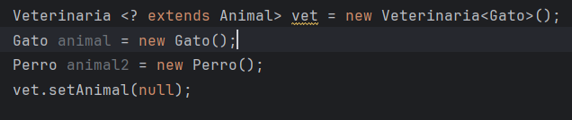
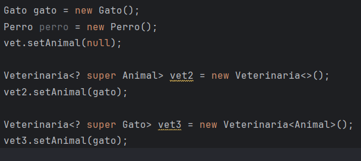

## Ejercicio 2
Considerando la siguiente clase: 
```java
public class Veterinaria<E> {
    private E animal;
public void setAnimal(E x) {
    animal = x;
}
public E getAnimal() {
    return animal;
}
}

public class Animal{
}

public class Gato extends Animal {
}

public class Perro extends Animal {
}
```


- **Caso i.** `Veterinaria<Animal> vet = new Veterinaria<Gato>();` Error de tipos 
- **Caso ii**. `Veterinaria<Gato> vet = new Veterinaria<Animal>();` No es posible convertir el animal a Gato.
- **caso iii**. `Veterinaria<?> vet = new Veterinaria<Gato>(); vet.setAnimal(new Gato());`  Es posible leer pero no escribir. Porque el compilador no sabe qué objeto es, entonces: 
    - Para obtenerlo: es necesario castear (me retorna un Object).
    - Para insertar: no es posible. 

- **caso iv**. `Veterinaria vet = new Veterinaria(); // RAW type` Se asume E = Object . Pierde seguridad de tipos. 
- **caso v**. `Veterinaria vet = new Veterinaria<?>();` Error en tiempo de compilación.
- **caso vi**. `Veterinaria <? extends Animal> vet = new Veterinaria<Gato>();` Es la forma correcta. La vet es de algún subtipo de Animal pero se desconoce de cual. En la instancia es de Gato.  

De esta forma no se puede escribir en la estructura (salvo null). Sin embargo la forma aceptable sería esta: 


## Ejercicio 3